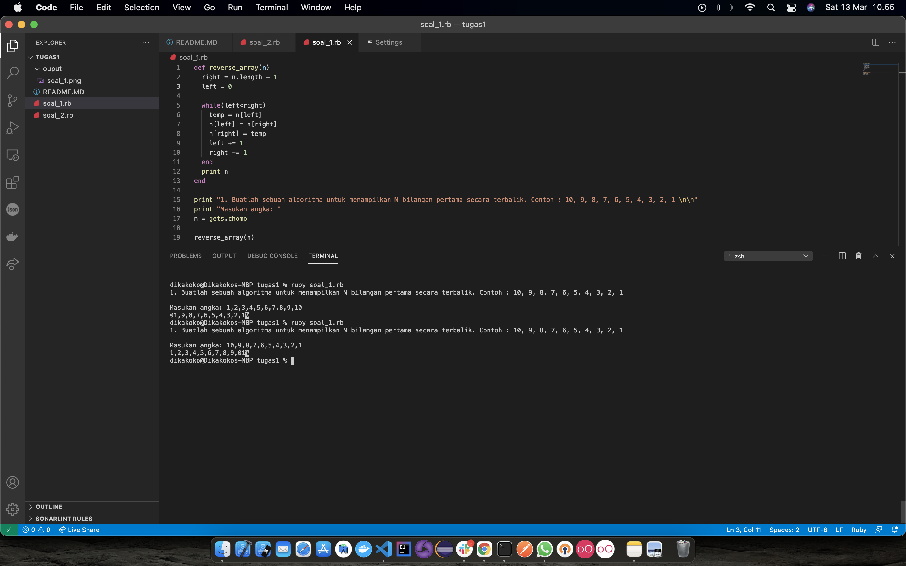
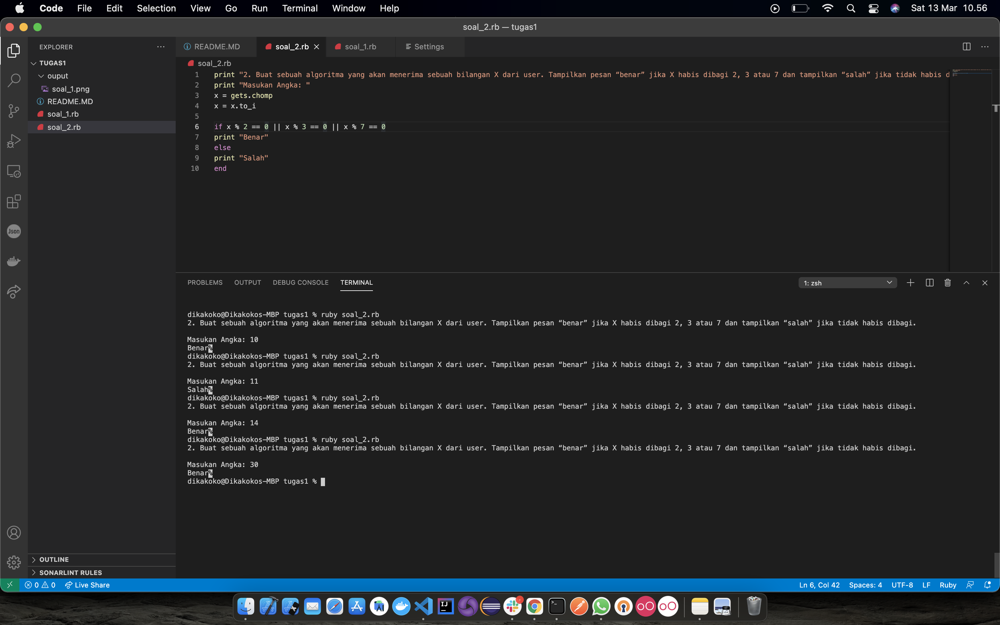

# Question
### 1. Buatlah sebuah algoritma untuk menampilkan N bilangan pertama secara terbalik. Contoh : 10, 9, 8, 7, 6, 5, 4, 3, 2, 1
#### Jawaban:

### 2. Buat sebuah algoritma yang akan menerima sebuah bilangan X dari user. Tampilkan pesan “benar” jika X habis dibagi 2, 3 atau 7 dan tampilkan “salah” jika tidak habis dibagi.
#### Jawaban:
